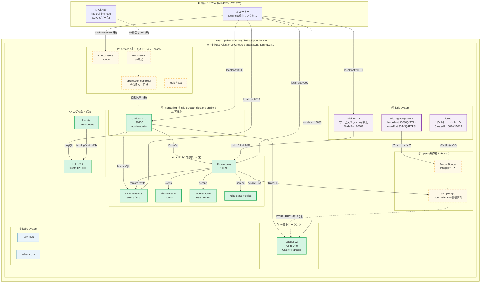
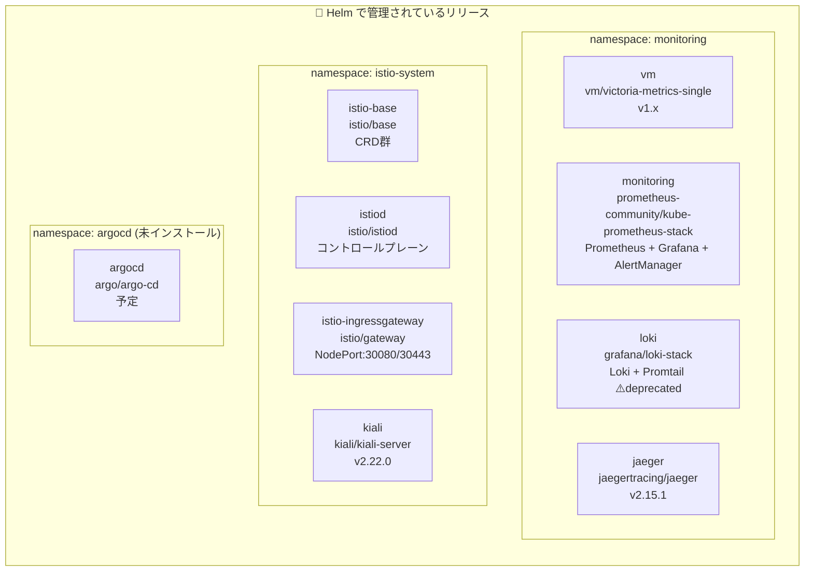
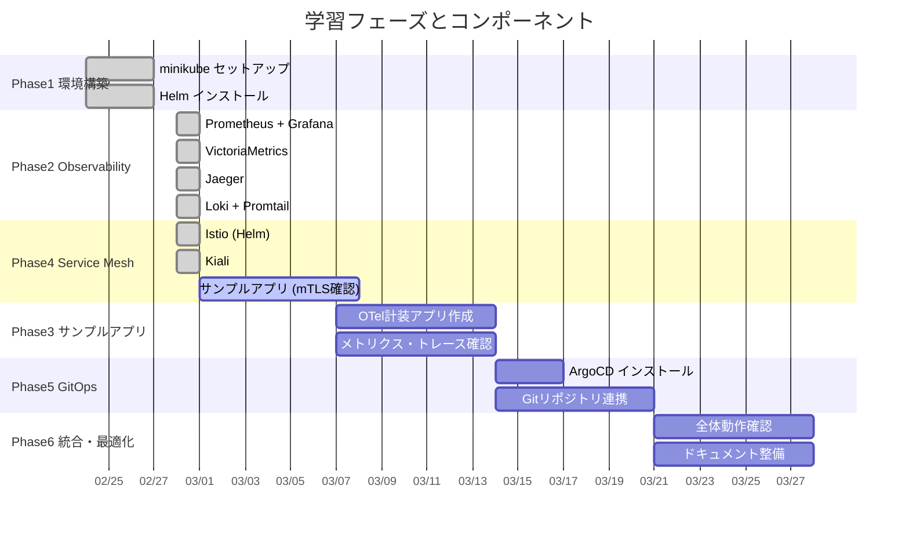

# Kubernetes クラスター構成図

> 最終更新: 2026-02-28 / 環境: minikube (WSL2 + Docker)

---

## 全体アーキテクチャ

---

## Helm リリース一覧

---

## データフロー詳細

---

## ポート一覧

### monitoring namespace

| サービス | Helm リリース | タイプ | ポート (port-forward) | 用途 |
|---|---|---|---|---|
| Grafana | monitoring | NodePort | **localhost:3000** | ダッシュボード (admin/admin) |
| Prometheus | monitoring | NodePort | **localhost:9090** | メトリクスUI・PromQL |
| VictoriaMetrics | vm | NodePort | **localhost:8428/vmui** | 高性能メトリクスDB・MetricsQL |
| AlertManager | monitoring | NodePort | **localhost:9093** | アラート管理UI |
| Jaeger UI | jaeger | ClusterIP | **localhost:16686** | 分散トレースUI |
| Loki | loki | ClusterIP | localhost:3100 | ログDB (Grafana経由で使用) |

### istio-system namespace

| サービス | Helm リリース | タイプ | ポート (port-forward) | 用途 |
|---|---|---|---|---|
| Kiali | kiali | NodePort | **localhost:20001** | サービスメッシュ可視化 |
| Ingress Gateway (HTTP) | istio-ingressgateway | NodePort | 30080 | 外部HTTPトラフィック |
| Ingress Gateway (HTTPS) | istio-ingressgateway | NodePort | 30443 | 外部HTTPSトラフィック |

### argocd namespace (未インストール)

| サービス | Helm リリース | タイプ | ポート | 用途 |
|---|---|---|---|---|
| ArgoCD Server | argocd | NodePort | localhost:8080 | GitOps UI |

---

## 学習フェーズ進捗

