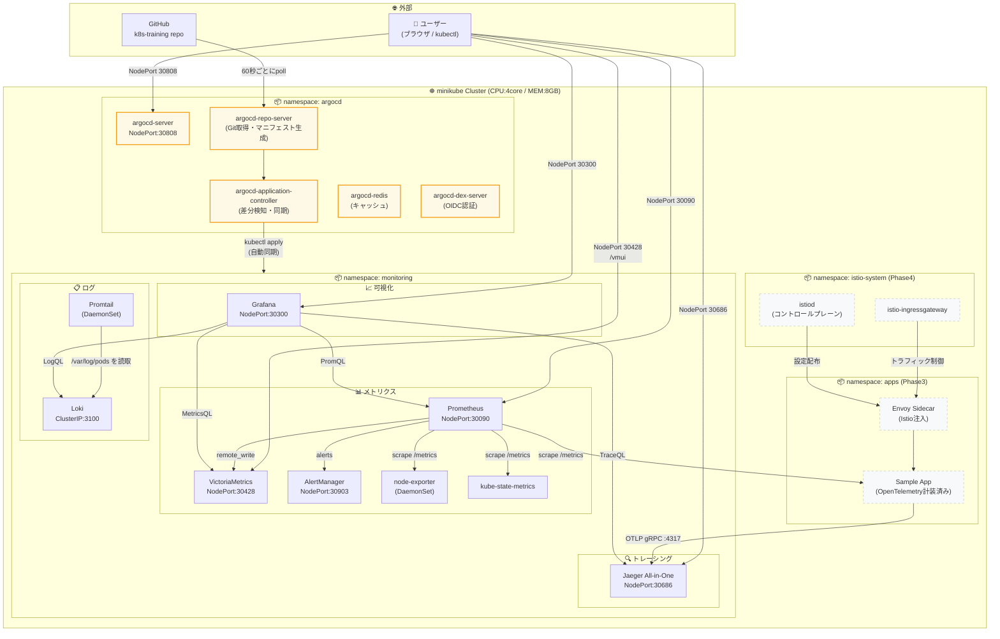
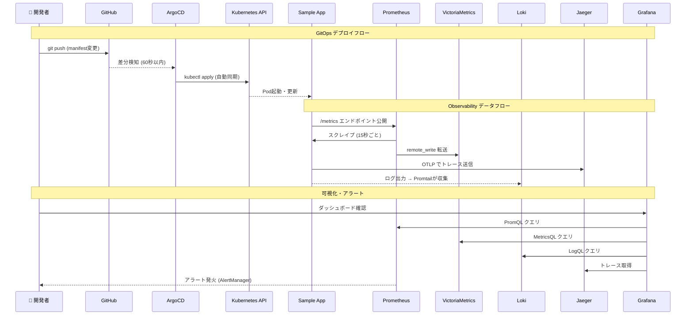
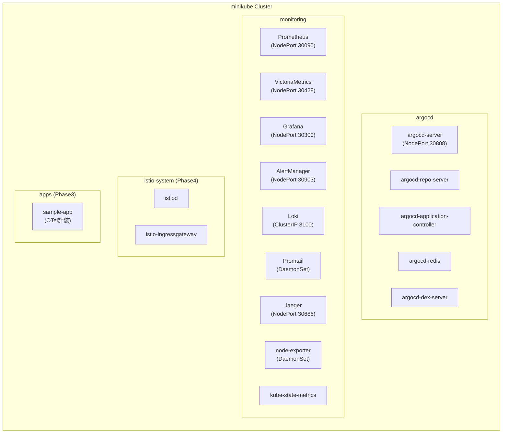
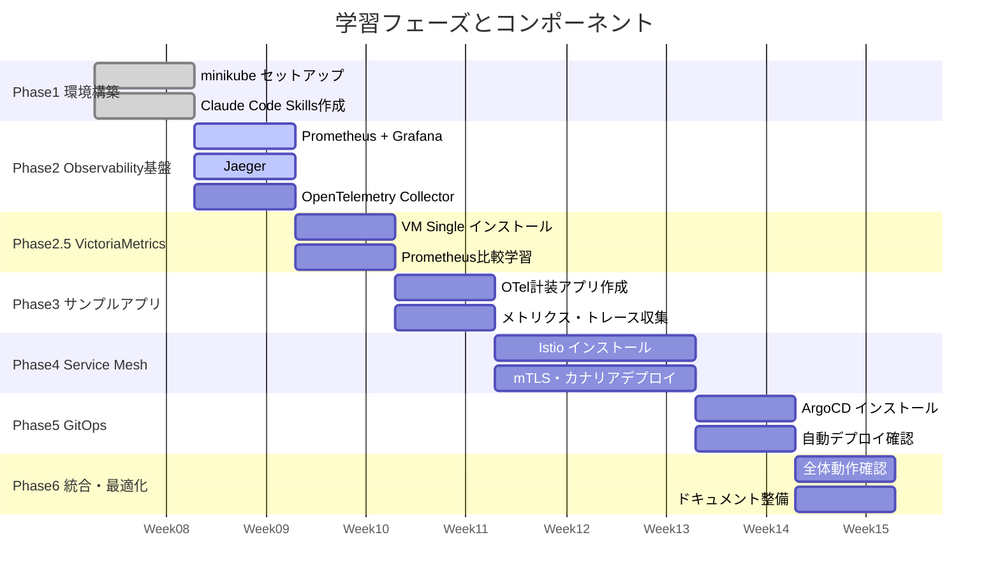

# Kubernetes クラスター構成図

## 全体アーキテクチャ

---

## データフロー詳細

---

## Namespace 構成

---

## ポート一覧

| サービス | Namespace | タイプ | ポート | 用途 |
|---|---|---|---|---|
| Grafana | monitoring | NodePort | **30300** | UI・ダッシュボード |
| Prometheus | monitoring | NodePort | **30090** | UI・クエリ |
| VictoriaMetrics | monitoring | NodePort | **30428** | UI (/vmui)・クエリ |
| AlertManager | monitoring | NodePort | **30903** | アラート管理UI |
| Jaeger | monitoring | NodePort | **30686** | トレースUI |
| Loki | monitoring | ClusterIP | 3100 | ログ書込・クエリ(内部のみ) |
| ArgoCD | argocd | NodePort | **30808** | GitOps UI |

---

## 学習フェーズとコンポーネントの対応

